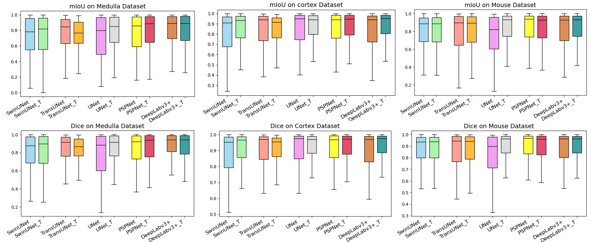
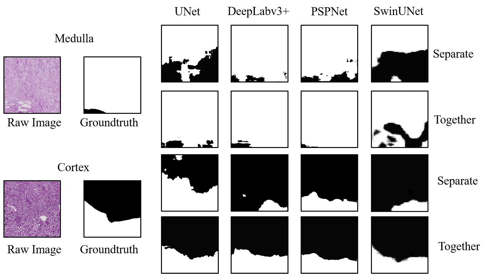

# layer_segmentation
This project consists of a collection of CNN-based and Transformer-based models for comparison experiments in layer segmentation programs.

- Incorporating cross-species homologous data for collaborative training can enhance the performance of models in segmenting the cortex and medulla in human kidney histopathology images.



1. To train CNN-based models, including `UNet`, `PSPNet`, and `Deeplab-v3+`:

```
CUDA_VISIBLE_DEVICES=0 python train.py
```

To validate and get `IoU` and `Dice score`, change the path of weight and run:

```
python predict_img.py
python get_metrics.py
```

2. To train Transformer-based models, including `TransUNet` and `Swin-UNet`:

```
CUDA_VISIBLE_DEVICES=0 python train.py --root_path '' --num_classes 5 --img_size 1024
```

To validate and get `IoU` and `Dice score`, change the path of weight and run:

```
python predict_img.py
python get_metrics.py
```



<p align="center">By utilizing external homologous data, the models have become better at perceiving edge textures, performing better in more precise localization of kidney layer boundaries. </p>

